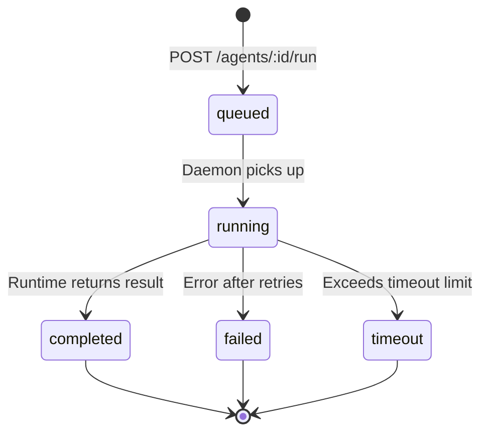

import { ArrowsClockwise, Play, List, CheckCircle, XCircle, Clock } from "@phosphor-icons/react";

## Run Object

A run represents a single execution of an agent against a given input.

```json
{
  "id": "run_01xyz...",
  "agentId": "agt_01abc...",
  "userId": "usr_01...",
  "status": "completed",
  "inputPayload": {
    "message": "Summarize the benefits of async programming in three bullet points."
  },
  "outputPayload": {
    "text": "Here is the analysis..."
  },
  "model": "claude-sonnet-4-6",
  "inputTokens": 312,
  "outputTokens": 847,
  "totalTokens": 1159,
  "durationMs": 2341,
  "turns": 1,
  "createdAt": "2026-03-13T00:00:00.000Z",
  "completedAt": "2026-03-13T00:00:02.341Z"
}
```

### Status Values

| Status | Description |
|---|---|
| `queued` | Accepted by the API, waiting for the daemon to pick up |
| `running` | Daemon has dispatched to the runtime — actively executing |
| `completed` | Finished successfully; `outputPayload` is populated |
| `failed` | Failed after all retry attempts; `errorCode` and `errorMessage` are set |
| `timeout` | Exceeded the configured timeout |



---

## Trigger a Run

See [POST /agents/:id/run](/api-reference/agents#run-an-agent).

---

## Get a Run

```bash
GET /agents/:agentId/runs/:runId
```

Returns the full run object. Use this to poll for completion if you are not using webhooks or the realtime WebSocket.

**Response:** `200 OK` — full run object as shown above.

---

## List Runs for an Agent

```bash
GET /agents/:agentId/runs
```

| Parameter | Type | Default | Description |
|---|---|---|---|
| `limit` | number | `20` | Max results per page (max: 100). |
| `offset` | number | `0` | Pagination offset. |
| `status` | string | — | Filter by status: `queued`, `running`, `completed`, `failed`, `timeout`. |
| `from` | string | — | ISO 8601 datetime — return runs created at or after this time. |
| `to` | string | — | ISO 8601 datetime — return runs created at or before this time. |

**Response:** `200 OK`
```json
{
  "data": [
    {
      "id": "run_01xyz...",
      "status": "completed",
      "model": "claude-sonnet-4-6",
      "inputTokens": 312,
      "outputTokens": 847,
      "durationMs": 2341,
      "createdAt": "2026-03-13T00:00:00.000Z",
      "completedAt": "2026-03-13T00:00:02.341Z"
    }
  ],
  "total": 47,
  "limit": 20,
  "offset": 0
}
```

---

## Failed Run Details

When a run has `status: "failed"`, the run object includes error information:

```json
{
  "id": "run_01xyz...",
  "status": "failed",
  "errorCode": "runtime_error",
  "errorMessage": "Runtime returned non-200 after 3 attempts",
  "inputTokens": 312,
  "outputTokens": 0,
  "durationMs": 9120
}
```

### Error Codes

| Code | Cause |
|---|---|
| `runtime_error` | Runtime returned an error response |
| `timeout` | Run exceeded the configured timeout |
| `quota_exceeded` | Monthly token quota hit during execution |
| `model_unavailable` | Model provider returned an error; cascade fallback exhausted |
| `risk_blocked` | Input or output failed risk checks |

---

## Live Status

<ArrowsClockwise size={18} weight="duotone" style={{display:"inline",verticalAlign:"middle",marginRight:"6px"}} /> For real-time run status without polling, use [webhooks](/guides/webhooks) or the [realtime WebSocket](/guides/realtime).

```typescript
// Option 1: webhook
// Register agent.run.completed / agent.run.failed on your endpoint

// Option 2: poll
async function waitForRun(agentId: string, runId: string) {
  while (true) {
    const run = await maschina.agents.getRun(agentId, runId);
    if (run.status === "completed" || run.status === "failed") return run;
    await new Promise(r => setTimeout(r, 2000));
  }
}
```
