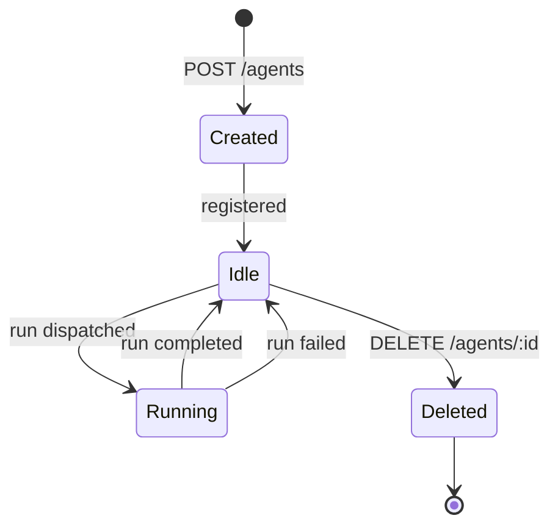
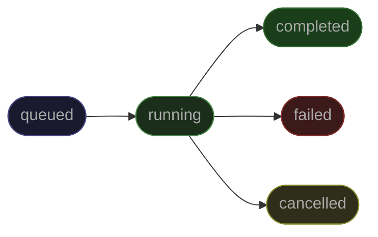

import { Robot, ArrowsClockwise, Cpu, CreditCard, Key, GitBranch, WifiHigh, ShieldCheck } from "@phosphor-icons/react";

## Agents

<Robot size={18} weight="duotone" style={{display:"inline",verticalAlign:"middle",marginRight:"6px"}} /> An agent is a persistent, configurable AI worker. It has a name, a type, a system prompt, and a model preference. Agents are templates — they define behavior. Runs are the actual executions.

```json
{
  "id": "agt_01abc...",
  "name": "Research Agent",
  "type": "analysis",
  "status": "idle",
  "config": {
    "systemPrompt": "You are a research analyst. Produce structured, cited summaries.",
    "model": "claude-sonnet-4-6"
  },
  "createdAt": "2026-03-01T00:00:00.000Z"
}
```

Agents are not stateful between runs. Each run starts fresh with the system prompt and the input you provide. If you need memory across runs, pass prior context in the `input` payload.

### Agent Types

| Type | Best for |
|---|---|
| `execution` | General task execution, automation, integrations |
| `analysis` | Data analysis, summarization, research |
| `signal` | Event detection, monitoring, alerting |
| `optimization` | Iterative improvement, A/B evaluation, tuning |
| `reporting` | Structured report generation, scheduled digests |

The type is metadata — it affects how the agent is categorized and searched but does not change execution behavior.

### Agent Lifecycle



---

## Runs

<ArrowsClockwise size={18} weight="duotone" style={{display:"inline",verticalAlign:"middle",marginRight:"6px"}} /> A run is a single execution of an agent. You provide an input, the Daemon picks it up from the queue, and the Runtime executes it. Runs are always async.

```json
{
  "id": "run_01xyz...",
  "agentId": "agt_01abc...",
  "status": "completed",
  "model": "claude-sonnet-4-6",
  "inputPayload": { "message": "Analyze Q1 revenue trends." },
  "outputPayload": { "text": "Q1 revenue grew 14% YoY driven by..." },
  "inputTokens": 312,
  "outputTokens": 847,
  "durationMs": 2341,
  "turns": 1,
  "createdAt": "2026-03-13T12:00:00.000Z",
  "completedAt": "2026-03-13T12:00:02.341Z"
}
```

### Run Lifecycle



- **queued** — accepted by the API and waiting in NATS JetStream
- **running** — Daemon has picked it up and Runtime is executing
- **completed** — output payload is ready
- **failed** — all retry attempts exhausted; error details attached
- **cancelled** — manually cancelled before execution

### Getting Results

Three options — choose based on your use case:

| Method | When to use |
|---|---|
| **Poll** `GET /agents/:id/runs/:runId` | Simple one-off runs |
| **Webhook** | Production workloads, async pipelines |
| **WebSocket / SSE** | Live UI that shows run progress in realtime |

---

## Models

<Cpu size={18} weight="duotone" style={{display:"inline",verticalAlign:"middle",marginRight:"6px"}} /> Maschina routes each run to a model based on your agent config or the per-run override. Each model has a minimum plan requirement and a billing multiplier.

### Billing Multiplier

Multipliers are applied to raw token counts. A run using 1,000 tokens on `claude-sonnet-4-6` (3x multiplier) deducts 3,000 tokens from your quota.

```
tokens_deducted = (input_tokens + output_tokens) × model_multiplier
```

### Supported Models

#### Anthropic

| Model | Context | Min Plan | Multiplier |
|---|---|---|---|
| `claude-haiku-4-5` | 200k | M1 | 1x |
| `claude-sonnet-4-5` | 1M | M5 | 3x |
| `claude-sonnet-4-6` | 1M | M5 | 3x |
| `claude-opus-4-5` | 200k | M10 | 15x |
| `claude-opus-4-6` | 1M | M10 | 15x |

#### OpenAI

| Model | Context | Min Plan | Multiplier |
|---|---|---|---|
| `gpt-5-nano` | 128k | M1 | 1x |
| `gpt-5-mini` | 400k | M1 | 1x |
| `o4-mini` | 200k | M1 | 2x |
| `gpt-5` | 1M+ | M5 | 8x |
| `gpt-5.4` | 1M+ | M5 | 10x |
| `gpt-5.4-pro` | 1M+ | M10 | 25x |
| `o3` | 200k | M10 | 20x |

#### Local (Ollama)

Local models run on your own hardware or a self-hosted Ollama instance. No tokens are deducted.

| Model | Multiplier |
|---|---|
| `ollama/llama3.2` | 0x |
| `ollama/llama3.1` | 0x |
| `ollama/mistral` | 0x |

Any model in your Ollama instance works with the `ollama/` prefix.

### Cascade Fallback

If a model is unavailable, Maschina automatically falls back to the next available model in your tier rather than failing the run.

```
claude-opus-4-6 → claude-sonnet-4-6 → claude-haiku-4-5
gpt-5.4-pro     → gpt-5.4           → gpt-5
```

### Passthrough Routing

Unrecognized model IDs are routed by prefix. M1 or higher required. A flat 2x multiplier applies.

```
claude-*    →  Anthropic API
gpt-* / o*  →  OpenAI API
```

---

## Plans

<CreditCard size={18} weight="duotone" style={{display:"inline",verticalAlign:"middle",marginRight:"6px"}} /> Plans control which models you can use, how many tokens you get per month, and which features are available.

| Plan | Price | Monthly Tokens | Default Model |
|---|---|---|---|
| Access | Free | — | `ollama/llama3.2` |
| M1 | $20/mo or $204/yr | 1M | `claude-haiku-4-5` |
| M5 | $60/mo or $600/yr | 5M | `claude-sonnet-4-6` |
| M10 | $100/mo or $995/yr | 10M | `claude-opus-4-6` |
| Mach Team | $30/seat/mo | 5M per seat | `claude-sonnet-4-6` |
| Enterprise | Custom | Unlimited | Custom |

- Tokens reset at the start of each billing period — unused tokens do not roll over
- Mach Team seats 10–24 pay $27/seat/mo; 25+ seats contact for Enterprise pricing
- Annual plans save roughly 15–17% vs monthly

### Feature Gates

| Feature | Access | M1 | M5 | M10 | Team |
|---|---|---|---|---|---|
| Ollama models | ✓ | ✓ | ✓ | ✓ | ✓ |
| Claude Haiku | — | ✓ | ✓ | ✓ | ✓ |
| Claude Sonnet | — | — | ✓ | ✓ | ✓ |
| Claude Opus | — | — | — | ✓ | — |
| GPT models | — | ✓ | ✓ | ✓ | ✓ |
| Webhooks | — | ✓ | ✓ | ✓ | ✓ |
| Search | — | ✓ | ✓ | ✓ | ✓ |
| Compliance / Audit Log | — | — | — | ✓ | — |

---

## API Keys

<Key size={18} weight="duotone" style={{display:"inline",verticalAlign:"middle",marginRight:"6px"}} /> API keys are the primary authentication method for machine-to-machine access. Keys are prefixed with `msk_` and displayed once on creation.

```
Authorization: Bearer msk_live_...
```

Keys can be scoped and named. Revoke them individually without affecting other keys. Manage keys from the [dashboard](https://app.maschina.ai/keys) or the CLI.

<Warning>
API keys are shown once. Store them immediately in your secrets manager or environment variables.
</Warning>

---

## Webhooks

<GitBranch size={18} weight="duotone" style={{display:"inline",verticalAlign:"middle",marginRight:"6px"}} /> Webhooks deliver signed HTTP POST payloads to your endpoint when events occur. Every delivery includes an `X-Maschina-Signature` header (HMAC-SHA256) that you must verify before processing.

### Events

| Event | Trigger |
|---|---|
| `agent.run.started` | Run picked up by Daemon and executing |
| `agent.run.completed` | Run finished with output |
| `agent.run.failed` | Run exhausted all retries |
| `subscription.updated` | Plan or billing status changed |
| `usage.quota_warning` | 80% of monthly token quota consumed |
| `usage.quota_exceeded` | Monthly quota exhausted — runs will be blocked |

See the [webhooks guide](/guides/webhooks) for setup, signature verification, and retry behavior.

---

## Realtime

<WifiHigh size={18} weight="duotone" style={{display:"inline",verticalAlign:"middle",marginRight:"6px"}} /> The Realtime service streams run status updates to connected clients over WebSocket or SSE. It subscribes to NATS events and fans them out per user — no polling, no missed updates.

```
wss://api.maschina.ai/realtime?token=YOUR_JWT
```

Subscribe to a specific run:

```json
{ "type": "subscribe", "runId": "run_01xyz..." }
```

You'll receive `run.status` events as the run progresses through `queued → running → completed`.

---

## Compliance

<ShieldCheck size={18} weight="duotone" style={{display:"inline",verticalAlign:"middle",marginRight:"6px"}} /> Available on M10 and Enterprise plans.

- **Audit Log** — every API action (agent create/update/delete, run start, key creation, billing event) is recorded with actor, timestamp, and IP
- **GDPR Deletion** — `POST /compliance/gdpr/delete` anonymizes your account and all associated data in accordance with Article 17
- **Data Retention** — run payloads are retained for a configurable window based on plan tier

| Plan | Retention |
|---|---|
| Access | 7 days |
| M1 | 30 days |
| M5 | 90 days |
| M10 | 365 days |
| Enterprise | Custom |

See the [environment variables reference](/self-hosting/environment) for retention configuration when self-hosting.
