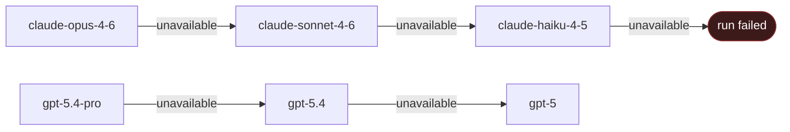

import { Cpu, ArrowsClockwise, Robot, Lightning } from "@phosphor-icons/react";

## Overview

Maschina supports models from Anthropic, OpenAI, and local Ollama instances. Each model has a minimum plan requirement and a billing multiplier applied to raw token counts.

You can specify a model when creating an agent (default for all runs) or override it per run.

## Choosing a Model

| Use case | Recommended model |
|---|---|
| High volume, low cost | `claude-haiku-4-5` or `gpt-5-mini` |
| Everyday tasks | `claude-sonnet-4-6` or `gpt-5` |
| Complex reasoning | `claude-opus-4-6` or `o3` |
| Local / offline / free | `ollama/llama3.2` |
| Code generation | `claude-sonnet-4-6` or `gpt-5` |
| Long documents | `claude-sonnet-4-6` (1M context) |

## Cascade Fallback

If a run fails due to model unavailability, Maschina automatically falls back to the next best model for your tier. You never get a hard failure from a transient model outage.



## Setting a Model

### On the agent (default for all runs)

```typescript
const agent = await maschina.agents.create({
  name: "My Agent",
  type: "execution",
  config: {
    model: "claude-sonnet-4-6",
    systemPrompt: "...",
  },
});
```

### Per run (override)

```typescript
const run = await maschina.agents.run(agent.id, {
  input: { message: "..." },
  model: "claude-opus-4-6",  // overrides agent default for this run
});
```

## Model Reference

### Anthropic

| Model | Context | Min plan | Multiplier |
|---|---|---|---|
| `claude-haiku-4-5` | 200k | M1 | 1x |
| `claude-sonnet-4-5` | 1M | M5 | 3x |
| `claude-sonnet-4-6` | 1M | M5 | 3x |
| `claude-opus-4-5` | 200k | M10 | 15x |
| `claude-opus-4-6` | 1M | M10 | 15x |

### OpenAI

| Model | Context | Min plan | Multiplier |
|---|---|---|---|
| `gpt-5-nano` | TBD | M1 | 1x |
| `gpt-5-mini` | 400k | M1 | 1x |
| `o4-mini` | 200k | M1 | 2x |
| `gpt-5` | 1M+ | M5 | 8x |
| `gpt-5.4` | 1M+ | M5 | 10x |
| `o3` | 200k | M10 | 20x |
| `gpt-5.4-pro` | 1M+ | M10 | 25x |

### Local (Ollama)

Local models run on your own hardware. No tokens are deducted from your quota.

| Model | Min plan | Multiplier |
|---|---|---|
| `ollama/llama3.2` | Access (free) | 0x |
| `ollama/llama3.1` | Access (free) | 0x |
| `ollama/mistral` | Access (free) | 0x |

Any model available in your Ollama instance can be used with the `ollama/` prefix.

## Passthrough Models

If you specify a model ID not in the catalog, Maschina routes it by prefix as long as you have M1 or higher. A flat 2x billing multiplier applies.

```typescript
// Routes to Anthropic — billed at 2x
model: "claude-future-model-x"

// Routes to OpenAI — billed at 2x
model: "gpt-6"
```
