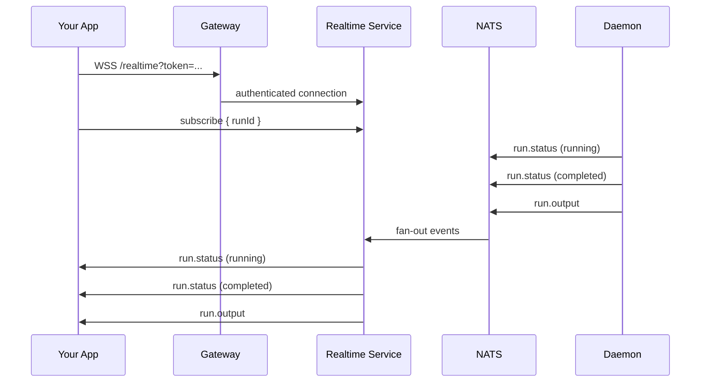

import { WifiHigh, Lightning, ArrowsClockwise, Bell } from "@phosphor-icons/react";

The Realtime service pushes run status events to connected clients as they happen. No polling required — connect once and receive updates the moment a run transitions state.

## How It Works

The Realtime service subscribes to NATS events from the Daemon and fans them out per user. When your run moves from `queued` to `running` to `completed`, your client receives each transition in real time.



## WebSocket

Connect with your JWT token:

```
wss://api.maschina.ai/realtime?token=YOUR_JWT
```

Or use an API key:

```
wss://api.maschina.ai/realtime?token=msk_live_...
```

### Subscribe to a run

```javascript
const ws = new WebSocket(`wss://api.maschina.ai/realtime?token=${token}`);

ws.onopen = () => {
  ws.send(JSON.stringify({
    type: "subscribe",
    runId: "run_01xyz...",
  }));
};

ws.onmessage = (event) => {
  const msg = JSON.parse(event.data);

  switch (msg.type) {
    case "run.status":
      console.log("Status:", msg.status); // queued | running | completed | failed
      break;
    case "run.output":
      console.log("Output:", msg.output);
      break;
    case "run.error":
      console.error("Error:", msg.error);
      break;
  }
};
```

### Subscribe to all runs for a user

Omit `runId` to receive events for all of your runs:

```javascript
ws.send(JSON.stringify({ type: "subscribe_all" }));
```

### Unsubscribe

```javascript
ws.send(JSON.stringify({
  type: "unsubscribe",
  runId: "run_01xyz...",
}));
```

## SSE (Server-Sent Events)

For environments where WebSocket isn't practical (some proxies, serverless edge):

```javascript
const source = new EventSource(
  `https://api.maschina.ai/realtime/sse?runId=run_01xyz...&token=${token}`
);

source.addEventListener("run.status", (e) => {
  const data = JSON.parse(e.data);
  console.log("Status:", data.status);
});

source.addEventListener("run.output", (e) => {
  const data = JSON.parse(e.data);
  console.log("Output:", data.output);
});

source.onerror = () => {
  console.error("SSE connection lost — reconnecting...");
  // EventSource reconnects automatically
};
```

## Event Reference

### run.status

Emitted on every run state transition.

```json
{
  "type": "run.status",
  "runId": "run_01xyz...",
  "agentId": "agt_01abc...",
  "status": "running",
  "timestamp": "2026-03-13T12:00:01.000Z"
}
```

### run.output

Emitted when the run completes with output.

```json
{
  "type": "run.output",
  "runId": "run_01xyz...",
  "agentId": "agt_01abc...",
  "output": { "text": "Q1 revenue grew 14% YoY..." },
  "model": "claude-sonnet-4-6",
  "inputTokens": 312,
  "outputTokens": 847,
  "durationMs": 2341
}
```

### run.error

Emitted when a run fails.

```json
{
  "type": "run.error",
  "runId": "run_01xyz...",
  "agentId": "agt_01abc...",
  "errorCode": "model_unavailable",
  "errorMessage": "All fallback models exhausted",
  "timestamp": "2026-03-13T12:00:05.000Z"
}
```

## TypeScript SDK Usage

The SDK wraps the WebSocket connection:

```typescript
const stream = await maschina.agents.stream(agentId, runId);

for await (const event of stream) {
  if (event.type === "run.status") {
    console.log("Status:", event.status);
  }
  if (event.type === "run.output") {
    console.log("Output:", event.output);
    break;
  }
}
```

## Connection Limits

| Plan | Concurrent connections |
|---|---|
| Access | 1 |
| M1 | 5 |
| M5 | 20 |
| M10 | 100 |
| Enterprise | Unlimited |

Connections exceeding the limit receive a `4029 Too Many Connections` close code.
