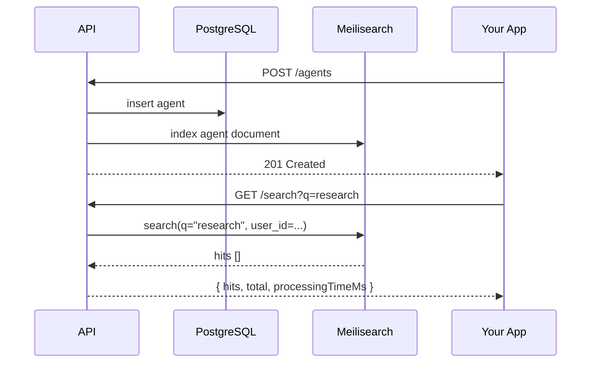

import { MagnifyingGlass, Lightning, ArrowsClockwise } from "@phosphor-icons/react";

<Lightning size={18} weight="duotone" style={{display:"inline",verticalAlign:"middle",marginRight:"6px"}} /> Maschina indexes your agents automatically using [Meilisearch](https://meilisearch.com). No configuration required — agents are searchable the moment you create them.

## How It Works



When you create or update an agent, the API writes to PostgreSQL and immediately syncs the document to Meilisearch. Search results are always scoped to your user — you never see another user's agents.

---

## Searching via SDK

<CodeGroup>

```typescript TypeScript
import { MaschinaClient } from "@maschina/sdk";

const maschina = new MaschinaClient({
  apiKey: process.env.MASCHINA_API_KEY,
});

// Basic search
const results = await maschina.search("research");

results.hits.forEach((agent) => {
  console.log(agent.name, agent.description);
});

// With options
const results = await maschina.search("market analysis", {
  type: "agents",
  limit: 10,
  offset: 0,
});

console.log(`Found ${results.total} agents in ${results.processingTimeMs}ms`);
```

```python Python
from maschina import MaschinaClient

maschina = MaschinaClient()

# Basic search
results = maschina.search("research")

for agent in results.hits:
    print(agent.name, agent.description)

# With options
results = maschina.search("market analysis", type="agents", limit=10)
print(f"Found {results.total} agents in {results.processing_time_ms}ms")
```

</CodeGroup>

---

## Searching via REST

```bash
curl "https://api.maschina.ai/search?q=research&type=agents&limit=20" \
  -H "Authorization: Bearer YOUR_API_KEY"
```

```bash
# URL-encode multi-word queries
curl "https://api.maschina.ai/search?q=market%20analysis&type=agents" \
  -H "Authorization: Bearer YOUR_API_KEY"
```

---

## Response Structure

```json
{
  "hits": [
    {
      "id": "agt_01abc...",
      "name": "Research Agent",
      "description": "Produces structured summaries from any topic.",
      "type": "analysis",
      "status": "idle",
      "model": "claude-sonnet-4-6",
      "createdAt": "2026-03-01T00:00:00.000Z"
    }
  ],
  "total": 1,
  "query": "research",
  "processingTimeMs": 2
}
```

---

## What Gets Indexed

Search matches against:
- **Name** — exact and fuzzy matching
- **Description** — full-text, including partial matches
- **Type** — `execution`, `analysis`, `signal`, `optimization`, `reporting`

Search does **not** match against:
- System prompts (these may contain sensitive data)
- Run history or run outputs
- API keys

---

## Pagination

```typescript
async function searchAll(query: string) {
  const limit = 100;
  let offset = 0;
  const all = [];

  while (true) {
    const results = await maschina.search(query, { limit, offset });
    all.push(...results.hits);
    if (all.length >= results.total) break;
    offset += limit;
  }

  return all;
}
```

---

## Search Availability

Search is available on all plan tiers. If Meilisearch is unavailable (e.g. during a self-hosted outage), the search endpoint returns an empty result set — the API itself continues to function normally.

Use `GET /agents` for list-based retrieval that doesn't require full-text search.

---

## CLI Search

```bash
maschina agent list --search "research"
```

The CLI passes your query to the search API and displays matching agents in a table.
