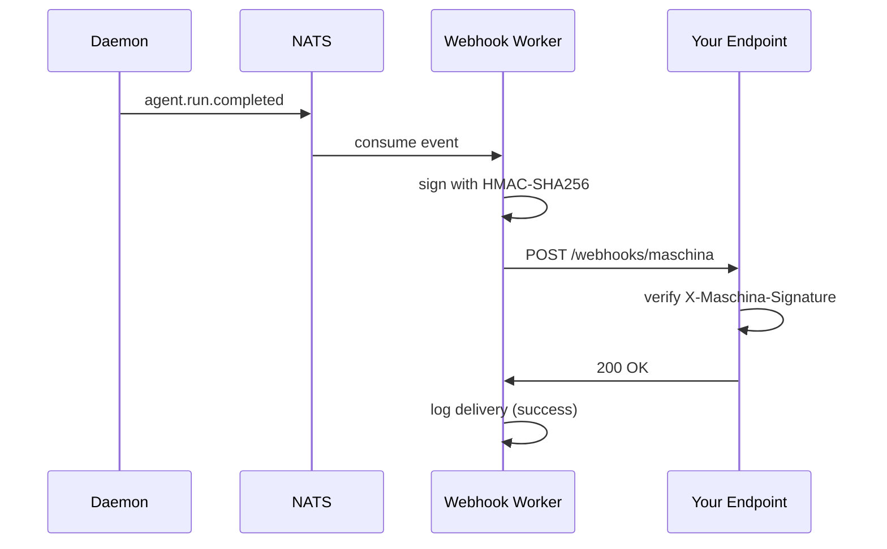

import { GitBranch, ShieldCheck, ArrowsClockwise, Bell, Warning } from "@phosphor-icons/react";

## Overview

Webhooks let you receive HTTP POST notifications from Maschina when events occur. Every delivery is signed with HMAC-SHA256 so you can verify it came from Maschina.



If your endpoint returns a non-2xx response, the Worker retries with exponential backoff up to 5 attempts.

## Creating a Webhook

```typescript
const webhook = await maschina.webhooks.create({
  url: "https://your-app.com/webhooks/maschina",
  events: ["agent.run.completed", "agent.run.failed"],
});

// Save this — shown once, never retrievable again
console.log(webhook.secret);
```

## Supported Events

| Event | Description |
|---|---|
| `agent.run.started` | A run has been picked up and is executing |
| `agent.run.completed` | A run finished successfully |
| `agent.run.failed` | A run failed after all retry attempts |
| `subscription.updated` | Plan or billing status changed |
| `usage.quota_warning` | 80% of monthly quota consumed |
| `usage.quota_exceeded` | Monthly quota exhausted |

## Payload Structure

Every delivery shares the same envelope structure:

```json
{
  "id": "del_01abc...",
  "type": "agent.run.completed",
  "created_at": "2026-03-13T12:00:00.000Z",
  "api_version": "2026-03-13",
  "data": { ... }
}
```

### agent.run.completed

```json
{
  "data": {
    "run_id": "run_01xyz...",
    "agent_id": "agt_01abc...",
    "user_id": "usr_01...",
    "model": "claude-sonnet-4-6",
    "input_tokens": 312,
    "output_tokens": 847,
    "duration_ms": 2341,
    "turns": 1
  }
}
```

### agent.run.failed

```json
{
  "data": {
    "run_id": "run_01xyz...",
    "agent_id": "agt_01abc...",
    "user_id": "usr_01...",
    "error_code": "timeout",
    "error_message": "Run timed out after 300s"
  }
}
```

## Verifying Signatures

<ShieldCheck size={18} weight="duotone" style={{display:"inline",verticalAlign:"middle",marginRight:"6px"}} /> Always verify the `X-Maschina-Signature` header before processing a delivery.

<CodeGroup>

```typescript TypeScript
import crypto from "node:crypto";

function verify(payload: string, secret: string, header: string): boolean {
  const expected = "sha256=" + crypto
    .createHmac("sha256", secret)
    .update(payload)
    .digest("hex");
  return crypto.timingSafeEqual(
    Buffer.from(header),
    Buffer.from(expected)
  );
}
```

```python Python
import hashlib
import hmac

def verify(payload: str, secret: str, header: str) -> bool:
    expected = "sha256=" + hmac.new(
        secret.encode(),
        payload.encode(),
        hashlib.sha256
    ).hexdigest()
    return hmac.compare_digest(header, expected)
```

</CodeGroup>

## Retry Behavior

<ArrowsClockwise size={18} weight="duotone" style={{display:"inline",verticalAlign:"middle",marginRight:"6px"}} /> If your endpoint returns a non-2xx response, Maschina retries with exponential backoff:

| Attempt | Delay |
|---|---|
| 1 | Immediate |
| 2 | 10 seconds |
| 3 | 30 seconds |
| 4 | 90 seconds |
| 5 | 5 minutes |

After 5 failures, the webhook is marked `failing`. Re-enable it from the dashboard or via `PATCH /webhooks/:id`.

## Testing Deliveries

Send a test delivery from the dashboard or API:

```bash
curl -X POST https://api.maschina.ai/webhooks/WEBHOOK_ID/test \
  -H "Authorization: Bearer YOUR_API_KEY"
```

## Viewing Delivery Logs

```bash
curl https://api.maschina.ai/webhooks/WEBHOOK_ID/deliveries \
  -H "Authorization: Bearer YOUR_API_KEY"
```
