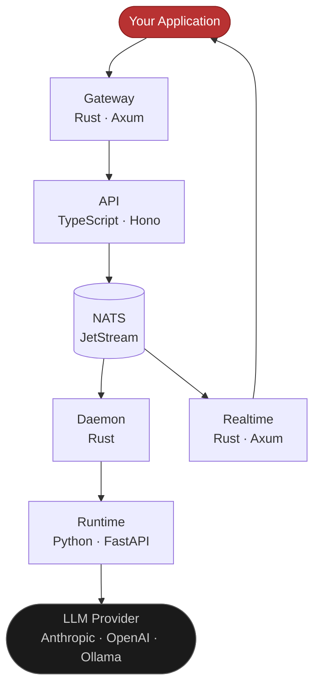

import { Cpu, Lock, CreditCard, Queue, MagnifyingGlass, ChartLine, GitBranch, WifiHigh } from "@phosphor-icons/react";

Maschina is the backend infrastructure layer for autonomous AI agents. It handles everything beneath the agent — runtime execution, model routing, authentication, billing, job queuing, webhooks, search, and observability — so you build the intelligence, not the plumbing.

<CodeGroup>

```bash npm
npm install @maschina/sdk
```

```bash pnpm
pnpm add @maschina/sdk
```

```bash yarn
yarn add @maschina/sdk
```

```bash pip
pip install maschina-sdk
```

</CodeGroup>

The docs and self-hosting configuration are open source and [contributions are welcome](https://github.com/maschina-labs/maschina/blob/main/CONTRIBUTING.md).

## What Maschina Provides

<CardGroup cols={2}>
  <Card title="Agent Runtime">
    <Cpu size={20} weight="duotone" /> Multi-turn execution with tool calling, risk checks, and model routing. Anthropic, OpenAI, and Ollama.
  </Card>
  <Card title="Auth & API Keys">
    <Lock size={20} weight="duotone" /> JWT sessions, scoped API keys, OAuth, RBAC, and rate limiting out of the box.
  </Card>
  <Card title="Billing & Quotas">
    <CreditCard size={20} weight="duotone" /> Prepaid token credits, per-model multipliers, quota enforcement, and Stripe.
  </Card>
  <Card title="Job Queue">
    <Queue size={20} weight="duotone" /> NATS JetStream-backed async execution with retries and dead-letter handling.
  </Card>
  <Card title="Webhooks">
    <GitBranch size={20} weight="duotone" /> Signed HTTP deliveries for every agent and billing event with automatic retry.
  </Card>
  <Card title="Realtime">
    <WifiHigh size={20} weight="duotone" /> Live run status over WebSocket or SSE — no polling required.
  </Card>
  <Card title="Search">
    <MagnifyingGlass size={20} weight="duotone" /> Instant full-text search across agents via Meilisearch, scoped per user.
  </Card>
  <Card title="Observability">
    <ChartLine size={20} weight="duotone" /> OpenTelemetry traces, Prometheus metrics, Sentry errors, audit logs.
  </Card>
</CardGroup>

## Architecture

Every request flows through a layered stack:



| Layer | Technology | Responsibility |
|---|---|---|
| Gateway | Rust / Axum | JWT validation, rate limiting, reverse proxy |
| API | TypeScript / Hono | Auth, RBAC, billing, agent CRUD, webhooks |
| Job Queue | NATS JetStream | Durable async execution, event bus |
| Daemon | Rust | Job orchestration, node routing, quota accounting |
| Runtime | Python / FastAPI | LLM execution, tool calling, risk checks |
| Realtime | Rust / Axum | WebSocket + SSE for live run updates |

## Who It's For

**Developers** building AI-powered products who want a production-ready agent backend without building auth, billing, and infrastructure from scratch.

**Teams** who need to give their users the ability to create, deploy, and run agents inside a multi-tenant product.

**Enterprises** who need compliance controls, audit logging, GDPR compliance, and SLA-backed reliability.

**Builders** who want to monetize agents — the agent marketplace is on the roadmap.

## Get Started

<CardGroup cols={2}>
  <Card title="Quickstart" icon="bolt" href="/quickstart">
    Create and run your first agent in under 5 minutes.
  </Card>
  <Card title="Concepts" icon="book" href="/concepts">
    Understand agents, runs, models, plans, and how they fit together.
  </Card>
  <Card title="TypeScript SDK" icon="code" href="/sdks/typescript">
    The fastest way to integrate Maschina into your app.
  </Card>
  <Card title="Self-Hosting" icon="server" href="/self-hosting/overview">
    Run Maschina on your own infrastructure with Docker.
  </Card>
</CardGroup>
