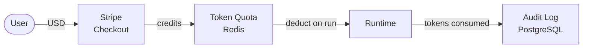
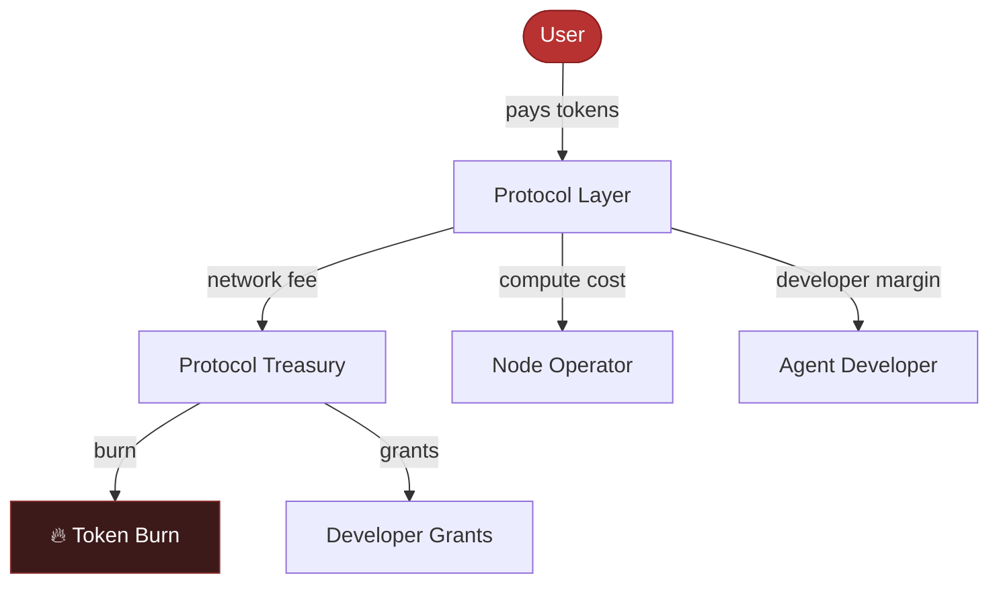
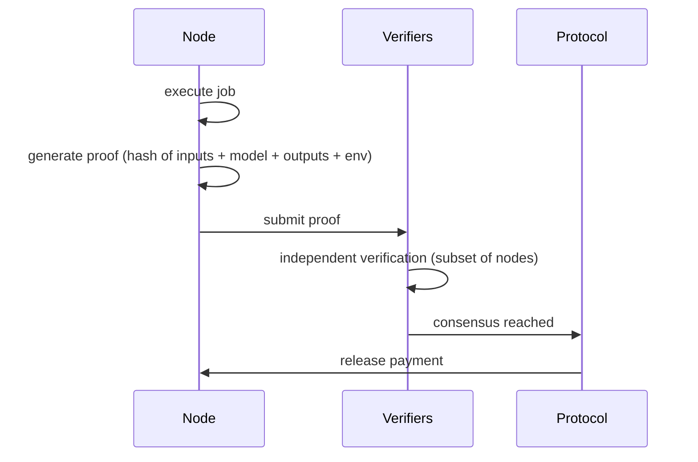
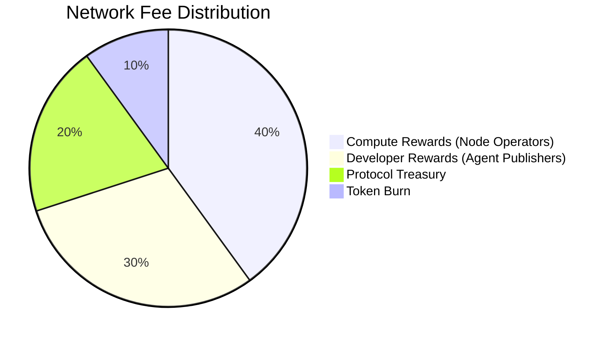

import { CreditCard, Coins, HardDrive, Users, ChartLine, ShieldCheck, Scales } from "@phosphor-icons/react";

<Info>
The token and on-chain economics layer is on the roadmap. The current billing system uses Stripe-based prepaid credits. This page covers both the current model and the full planned economic architecture.
</Info>

## Current Billing Model

Today, Maschina uses a prepaid credit system:

- Credits are purchased in USD via Stripe Checkout
- Each plan tier includes a monthly token allocation
- Token consumption = (input tokens + output tokens) × model multiplier
- Usage is tracked in real time against your quota
- Overage is blocked by default; contact support for burst allowances

This model is simple, auditable, and familiar. It runs entirely on Stripe + PostgreSQL.

---

## Full Economic Architecture

As the network scales, Maschina transitions from a centralized credit system to a distributed token economy that aligns incentives across all participants.

### Participants

| Participant | Role | Economic Relationship |
|---|---|---|
| **Users** | Submit agent runs | Pay for compute consumed |
| **Developers** | Build and publish agents | Earn margins on skill invocations |
| **Node Operators** | Contribute compute | Earn rewards for verified work |
| **Stakers** | Provide economic security | Earn yield on staked capital |
| **Maschina** | Infrastructure and protocol | Collects network fees |

### The Maschina Token

The native token serves as the settlement currency for all network transactions.

**Utility:**
- <HardDrive size={16} weight="duotone" style={{display:"inline",verticalAlign:"middle",marginRight:"6px"}} />Pay for compute resources on the network
- <Coins size={16} weight="duotone" style={{display:"inline",verticalAlign:"middle",marginRight:"6px"}} />Stake to participate as a node operator
- <ChartLine size={16} weight="duotone" style={{display:"inline",verticalAlign:"middle",marginRight:"6px"}} />Earn rewards for contributing verified compute
- <Scales size={16} weight="duotone" style={{display:"inline",verticalAlign:"middle",marginRight:"6px"}} />Governance participation (protocol upgrades, parameter changes)
- <ShieldCheck size={16} weight="duotone" style={{display:"inline",verticalAlign:"middle",marginRight:"6px"}} />Access to premium features and priority routing

**Token flows:**

### Token Emission

The network incentivizes early participation through a structured emission schedule:

- Tokens are emitted as rewards for verified compute contribution
- Emission rate decreases over time (deflationary pressure)
- A portion of network fees is burned, reducing circulating supply
- Early node operators receive higher emission rates as network bootstrap incentives

### Staking Mechanics

Node operators stake tokens to participate in job routing. Staking:

- **Signals commitment** — operators with skin in the game are prioritized
- **Provides security** — staked capital is at risk for misbehavior (slashing)
- **Earns yield** — stakers earn a share of network fees proportional to their stake
- **Enables governance** — stake-weighted voting on protocol parameters

Minimum stake requirements vary by node tier. Enterprise nodes require higher minimum stakes but receive proportionally higher job volume and fee share.

### Proof of Compute

Before a node receives payment for a completed job, it must provide a Proof of Compute — a cryptographic verification that the work was performed correctly.

If verification fails or a dispute is raised, the job is re-executed and the dispute evidence is evaluated. Nodes providing fraudulent results face stake slashing.

### Compute Marketplace Dynamics

As more nodes join, the compute marketplace becomes competitive:

- Node operators compete on price, latency, and reliability
- Users benefit from lower compute costs as supply grows
- Specialized nodes (high-end GPUs, specific hardware) command premiums
- Geographic arbitrage — nodes in underserved regions can offer lower latency at competitive prices

Supply and demand dynamics are reflected in real-time routing decisions. When a particular hardware class is in high demand, the router pays premium rates. When supply is abundant, costs fall.

---

## Solana Integration

Maschina's on-chain layer runs on Solana, chosen for:

- **Transaction throughput** — high TPS required for per-execution micropayments
- **Low fees** — sub-cent transaction costs make micropayments viable
- **Ecosystem** — access to Solana DeFi for liquidity, staking derivatives, and composability
- **Helius** — used as the data layer for on-chain reputation, staking, and settlement events

Smart contracts govern:
- Node registration and stake
- Slashing conditions and execution
- Reward distribution
- Protocol governance votes

Off-chain systems (the Maschina API, Daemon, Runtime) handle the actual workload execution. On-chain settlement happens after job completion verification.

---

## Revenue Distribution

Every network fee is split across participants:

| Recipient | Share | Purpose |
|---|---|---|
| Compute rewards pool | 40% | Distributed to node operators per verified job |
| Developer rewards | 30% | Distributed to agent publishers per invocation |
| Protocol treasury | 20% | Funds development, grants, and infrastructure |
| Token burn | 10% | Deflationary pressure, reduces circulating supply |

These ratios are initial parameters subject to governance adjustment as the network matures.
