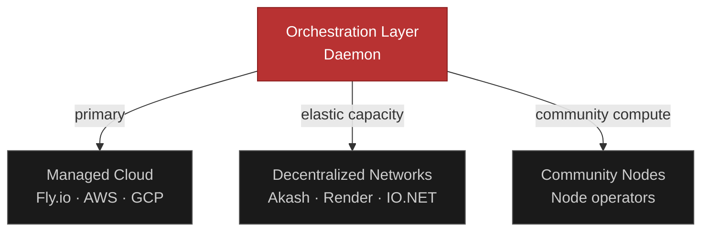
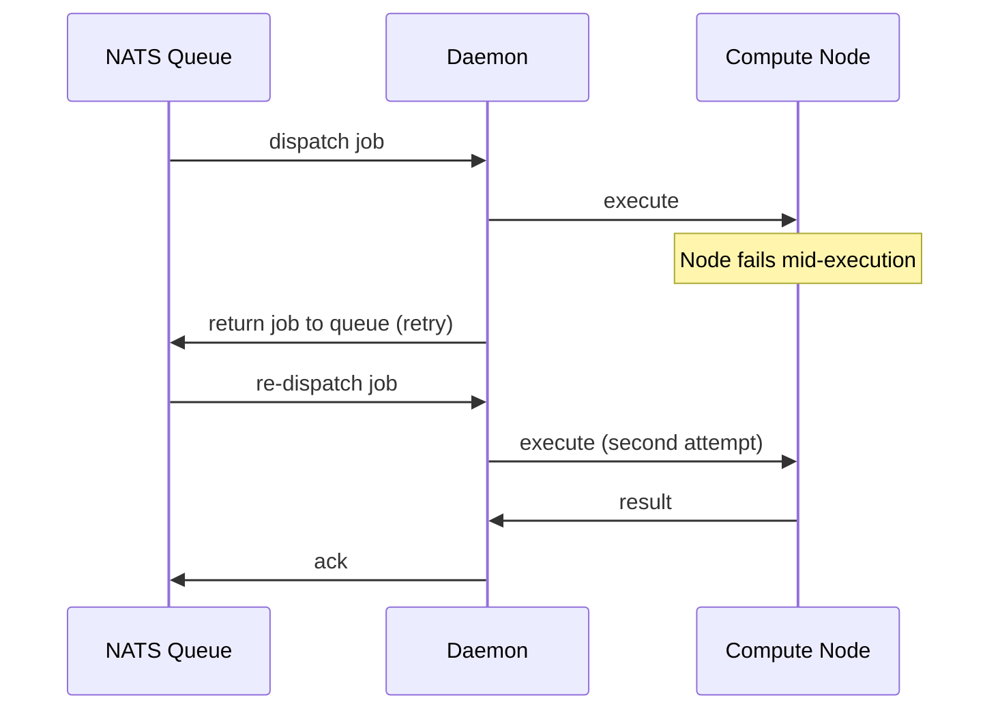

import { Network, GitFork, HardDrive, ArrowsOut, ShieldCheck, Globe } from "@phosphor-icons/react";

The Maschina Network is a distributed compute environment where agent workloads are executed across a heterogeneous pool of infrastructure providers. Rather than relying on a single cloud provider, Maschina aggregates compute from multiple sources and routes jobs to the node best suited for each workload.

## Why a Network

Centralized compute has three fundamental problems for a platform like Maschina:

1. **Capacity bottlenecks** — a single provider becomes the limit on how many agents can run simultaneously
2. **Cost monopoly** — no competitive pressure on pricing
3. **Geographic constraints** — latency and data residency issues for global deployments

A distributed network solves all three by introducing competition, geographic distribution, and redundancy across providers.

## How It Works

When a run is submitted, the orchestration layer routes it through a multi-step process:

### Task Metadata

Every job carries metadata that the router uses to make scheduling decisions:

- **Hardware requirements** — CPU-only vs. GPU-accelerated
- **Memory requirements** — standard vs. large-context workloads
- **Priority tier** — urgent vs. background
- **Cost constraints** — max acceptable compute cost
- **Latency sensitivity** — real-time vs. batch

### Compute Routing Factors

The router evaluates candidate nodes against:

| Factor | Description |
|---|---|
| Hardware capability | Does the node have the GPU/CPU/memory required? |
| Current availability | Is the node accepting new jobs? |
| Reputation score | Historical uptime and task completion rate |
| Geographic proximity | Network latency to the requesting user |
| Cost | Pricing for the required compute class |

Nodes with strong reputation are prioritized. Nodes with poor reliability are deprioritized and eventually removed from the active pool.

## Infrastructure Sources

### Managed Cloud (Current)

The initial deployment runs entirely on managed infrastructure — Fly.io for services, Neon for PostgreSQL, Upstash for Redis. This provides the predictability needed for early-stage reliability.

### Decentralized Compute Networks (Planned)

Integration with open compute marketplaces allows Maschina to source GPU and CPU resources on demand without owning hardware:

- **Akash Network** — decentralized cloud, Kubernetes-compatible
- **Render Network** — GPU-focused, designed for AI workloads
- **IO.NET** — aggregated GPU capacity from data centers and consumer hardware

These integrations allow Maschina to scale elastically and source compute at market rates rather than fixed provider pricing.

### Community Nodes (Planned)

Individuals and organizations can contribute compute directly to the Maschina Network by running the Maschina node client. Community nodes:

- Register with the orchestration layer and advertise available resources
- Accept jobs that match their hardware capabilities
- Earn network incentives based on tasks completed and compute contributed

Community nodes transform idle hardware into productive network capacity.

## Fault Tolerance

The distributed queue is designed for fault tolerance:

- Jobs are durably stored in NATS JetStream — no job is lost if a node fails
- Tasks carry configurable retry policies
- If a node fails during execution, the job is automatically returned to the queue and rescheduled
- Nodes that become unreachable are removed from the active pool until they recover and re-register

## Hybrid Model

Maschina does not commit exclusively to any infrastructure class. The orchestration layer treats all sources — managed cloud, decentralized networks, community nodes — as a unified compute pool. Jobs are routed to wherever offers the best balance of performance, reliability, and cost for that specific workload.

This hybrid model provides:

- <ShieldCheck size={16} weight="duotone" style={{display:"inline",verticalAlign:"middle",marginRight:"6px"}} />**Resilience** — no single provider outage takes down the network
- <ArrowsOut size={16} weight="duotone" style={{display:"inline",verticalAlign:"middle",marginRight:"6px"}} />**Cost efficiency** — competitive routing between providers
- <Network size={16} weight="duotone" style={{display:"inline",verticalAlign:"middle",marginRight:"6px"}} />**Scale** — compute capacity grows as more nodes join, not as contracts are signed
- <Globe size={16} weight="duotone" style={{display:"inline",verticalAlign:"middle",marginRight:"6px"}} />**Geographic reach** — route to nodes near your users without manual configuration
