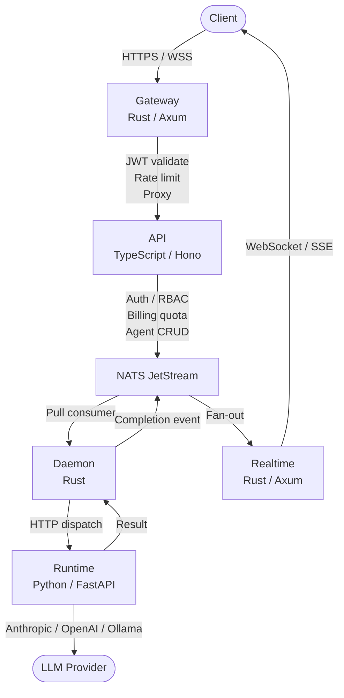
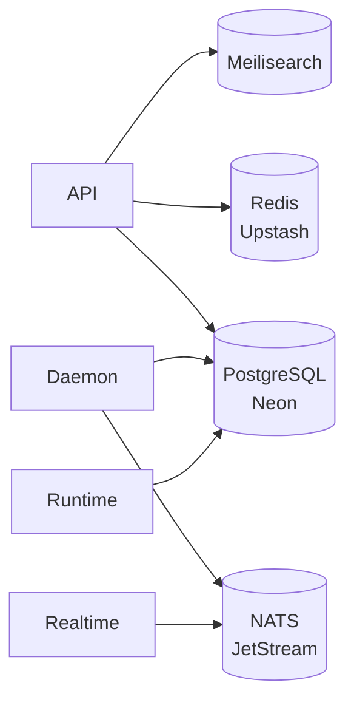
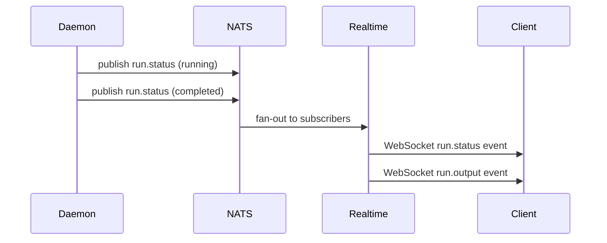

import { Stack, Network, Database, Broadcast, ArrowsClockwise, ShieldCheck, Robot } from "@phosphor-icons/react";

Maschina is a layered infrastructure platform. Each service has a single responsibility and communicates through well-defined interfaces. No service is a monolith — every layer can evolve independently.

## Request Flow

Every client request flows through a strict pipeline:



## Services

| Service | Language | Role |
|---|---|---|
| **Gateway** | Rust / Axum | JWT validation, per-IP and per-user rate limiting, HTTP + WebSocket proxy |
| **API** | TypeScript / Hono | Auth, RBAC, billing, agent CRUD, webhook management, search, compliance |
| **Daemon** | Rust | NATS pull consumer, job orchestration, node routing, quota accounting |
| **Runtime** | Python / FastAPI | Agent execution, multi-turn LLM calls, tool calling, risk checks |
| **Realtime** | Rust / Axum | WebSocket + SSE, per-user event fan-out from NATS |

## Data Layer



| Store | Purpose |
|---|---|
| **PostgreSQL** | Users, agents, runs, keys, webhooks, billing, audit logs — source of truth |
| **Redis** | Quota counters, rate limit state — low-latency reads |
| **NATS JetStream** | Durable job queue, event bus, webhook dispatch, realtime fan-out |
| **Meilisearch** | Full-text search index for agents — synced on create / update / delete |

## Daemon Pipeline

<ArrowsClockwise size={18} weight="duotone" style={{display:"inline",verticalAlign:"middle",marginRight:"6px"}} /> The Daemon (Rust) is the orchestration core. It runs a four-stage pipeline for every agent run:

```
SCAN → EVALUATE → EXECUTE → ANALYZE
```

1. **SCAN** — pulls jobs from the `MASCHINA_JOBS` NATS stream via pull consumer
2. **EVALUATE** — validates the job, checks quota, resolves model and target node
3. **EXECUTE** — dispatches to the Runtime via HTTP POST `/run`, awaits result
4. **ANALYZE** — records result in PostgreSQL, deducts tokens from Redis quota, publishes completion event to NATS

If the Runtime returns an error or times out, the Daemon retries up to the configured limit, then marks the run `failed` and publishes a `agent.run.failed` event.

## Realtime Event Flow



The Realtime service maintains a per-user subscription registry (dashmap). When a user connects, they can subscribe to specific run IDs or all their runs. NATS events are routed to matching connections with zero polling.

## Security Boundaries

- **Gateway** terminates TLS, validates JWTs, and enforces rate limits before any request reaches the API
- **API** enforces RBAC — every route checks the authenticated user's plan tier and permissions
- **Runtime** runs inside Docker containers — no direct database access, no network access except to LLM providers
- **Risk checks** run on both input and output — blocked patterns, PII scanning, quota enforcement
- **Webhooks** are signed with HMAC-SHA256 — receivers must verify before processing

## Deployment

| Deployment | Infrastructure |
|---|---|
| Managed (`app.maschina.ai`) | Fly.io (services), Neon (PostgreSQL), Upstash Redis, NGS (NATS) |
| Self-hosted | Docker Compose — all services + dependencies, or point at managed dependencies |

See the [Docker guide](/self-hosting/docker) for setup instructions.
