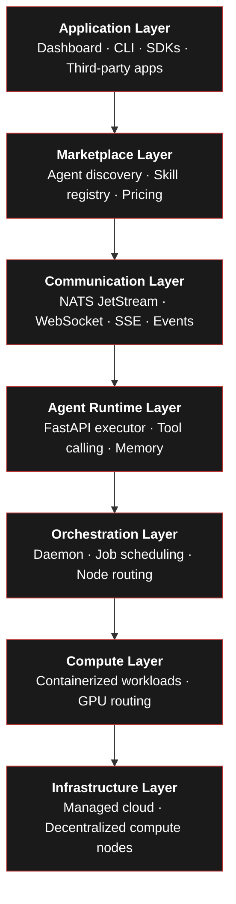

import { Stack, ComputerTower, Rows, Robot, Broadcast, Storefront, AppWindow, Network, ShieldCheck, Infinity, ArrowsOut } from "@phosphor-icons/react";

Maschina is not just an API wrapper around a language model. It is a distributed infrastructure platform designed to be the foundational layer for autonomous digital labor at scale.

The platform is built in layers. Each layer operates independently while remaining compatible with the rest of the stack. This design allows individual components to evolve without breaking the system.

## The Seven Layers

### Infrastructure Layer

The foundation. Provides the physical and virtual hardware on which all workloads execute. This layer is intentionally hybrid — Maschina aggregates resources from:

- **Managed cloud** (Fly.io, AWS) — the initial deployment target; predictable, reliable
- **Decentralized networks** (Akash, Render, IO.NET) — elastic capacity sourced from open compute markets
- **Community nodes** — hardware contributed by node runners in exchange for network incentives

No single provider owns the infrastructure. This is by design.

### Compute Layer

Manages the execution environments. All agent workloads run in containers for isolation and reproducibility. The compute layer handles:

- Container lifecycle and resource limits
- GPU scheduling for inference-heavy workloads
- Execution environment isolation between tenants

### Orchestration Layer

The control plane. The Daemon (Rust) is the central orchestrator — it consumes jobs from NATS JetStream, evaluates them, routes them to the appropriate compute node, dispatches to the Runtime, and records results.

When a run is submitted, the orchestration layer decides:
- Which node is best suited (capability, availability, reputation, cost)
- How to retry on failure
- When to escalate or dead-letter

### Agent Runtime Layer

Where agents actually execute. The Runtime (Python/FastAPI) receives dispatched jobs, runs input risk checks, routes to the correct model provider, executes multi-turn conversations with tool calling, runs output risk checks, and returns the result. It is intentionally isolated from the rest of the stack — it receives a job, executes it, and returns a structured result.

### Communication Layer

All internal and external events flow through NATS JetStream. This provides:

- Durable job queues that survive restarts
- Fan-out event streams for realtime updates
- Ordered delivery guarantees
- Dead-letter handling for failed jobs

External clients receive events via WebSocket or SSE through the Realtime service.

### Marketplace Layer

Coming. The marketplace layer will allow developers to publish agents as discoverable services with defined skills, pricing, and SLA expectations. Other agents and users can discover and invoke marketplace agents without knowing implementation details.

### Application Layer

The SDKs, CLI, dashboard, and any third-party apps built on top. This is where developers spend most of their time.

---

## Design Principles

<Stack size={18} weight="duotone" style={{display:"inline",verticalAlign:"middle",marginRight:"6px"}} />**Infrastructure first.** Maschina provides the layer beneath the intelligence. Developers build what agents do — Maschina handles how they run.

<Robot size={18} weight="duotone" style={{display:"inline",verticalAlign:"middle",marginRight:"6px"}} />**Agent-first architecture.** Agents are the central building block, not requests or sessions. Everything — billing, auth, observability, routing — is modeled around the agent primitive.

<Rows size={18} weight="duotone" style={{display:"inline",verticalAlign:"middle",marginRight:"6px"}} />**Composability.** Agents can call other agents. Skills are defined through standardized interfaces. The system is designed for multi-agent workflows to emerge naturally.

<Infinity size={18} weight="duotone" style={{display:"inline",verticalAlign:"middle",marginRight:"6px"}} />**Autonomy.** Agents should be able to operate without continuous human supervision. The platform provides the scaffolding for truly autonomous workloads.

<Network size={18} weight="duotone" style={{display:"inline",verticalAlign:"middle",marginRight:"6px"}} />**Decentralization.** As the network matures, compute ownership will shift from centralized providers to a distributed network of node runners, reducing single points of failure and enabling competitive compute pricing.

<ShieldCheck size={18} weight="duotone" style={{display:"inline",verticalAlign:"middle",marginRight:"6px"}} />**Verifiable execution.** Tasks executed across distributed providers must produce results that can be trusted. Multi-node verification, consensus validation, and TEE attestation ensure the system remains reliable across heterogeneous infrastructure.

---

## Current State vs. Full Vision

| Area | Current State | Full Vision |
|---|---|---|
| Compute | Managed cloud (Fly.io) | Hybrid: cloud + decentralized nodes + community hardware |
| Models | Anthropic, OpenAI, Ollama | Any provider + fine-tuned models on network nodes |
| Agent execution | Single-agent runs | Multi-agent workflows, agent-to-agent calling |
| Marketplace | — | Agent discovery, skill registry, usage-based pricing |
| Economics | Stripe credits | Maschina token + on-chain settlement (Solana) |
| Identity | JWT + API keys | Platform identity + node identity + on-chain reputation |
| Nodes | — | Open node network with staking, reputation, and TEE attestation |
| Memory | Per-run context | Short-term, long-term, and shared network memory across agents |
| Governance | Centralized | Stake-weighted on-chain governance for protocol parameters |

The platform is being built in phases. The current release covers the core infrastructure stack. Distributed compute, the marketplace, and on-chain economics are on the active roadmap.

See the [roadmap](/platform/roadmap) for the full phased plan.
